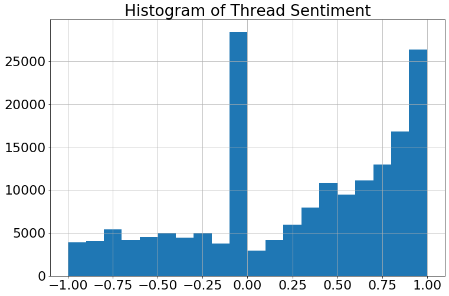
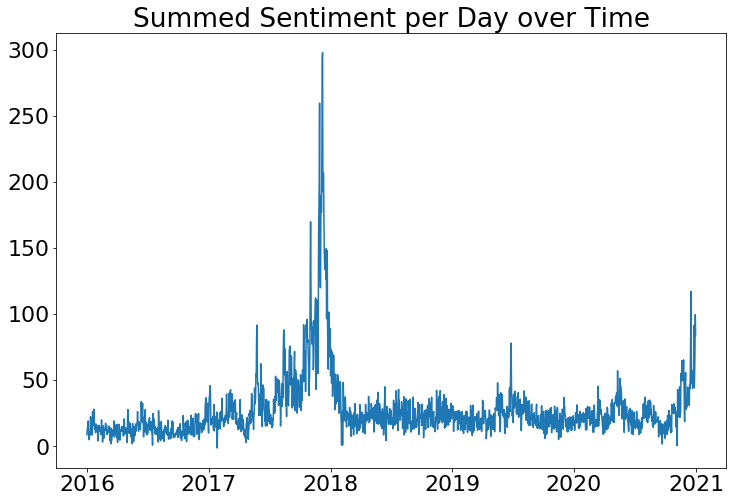
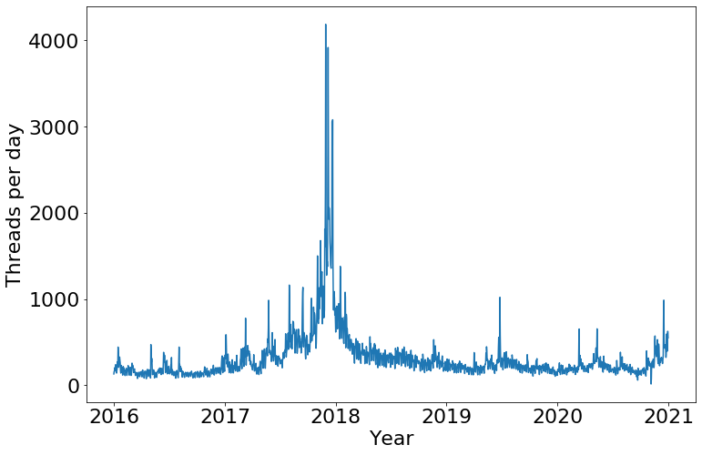
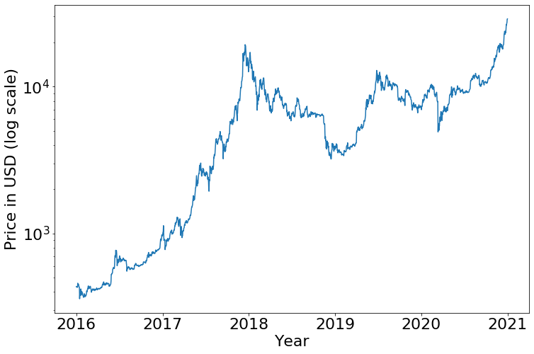
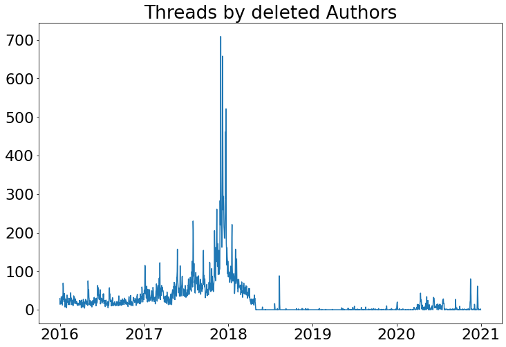
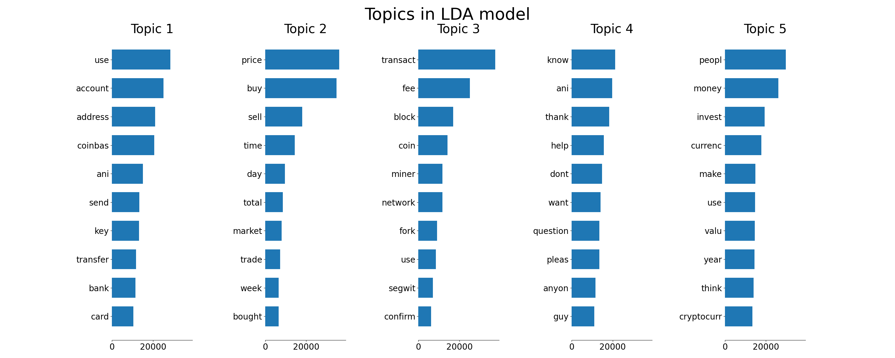
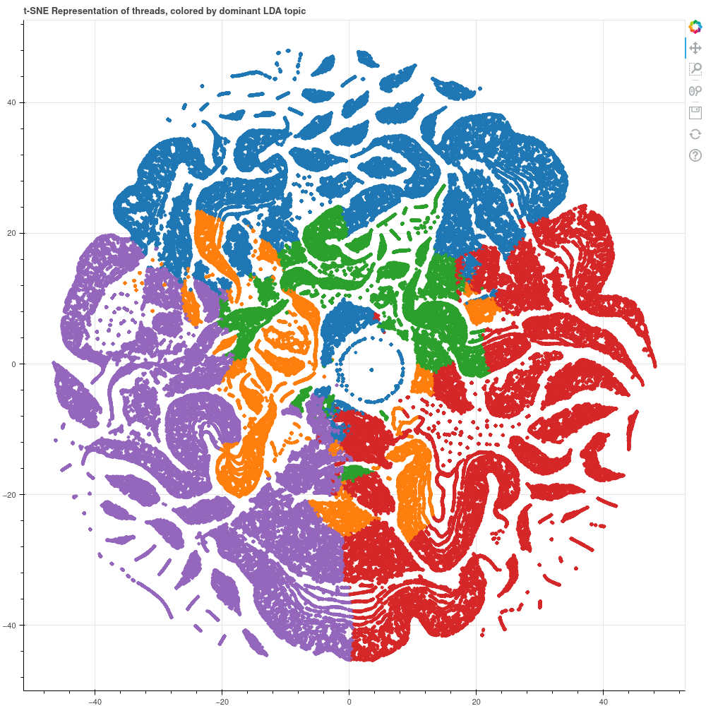

by Nura Kawa and [Jasper Schr&#246;der](https://github.com/jasperschroeder)  

_This post is part of a larger project that explores the r/Bitcoin subreddit and analyzes Bitcoin price and volatilty. The full project can be found on [Github](https://github.com/jasperschroeder/BigDataClass)._

Reddit has received a lot of attention since the [GameStop short squeeze](https://en.wikipedia.org/wiki/GameStop_short_squeeze), a financial phenomenon fueled by activity on the r/wallstreetbets subreddit, an online public forum. In January 2021, retail investors gathered on r/wallstreetbets to collectively buy shares of GameStop, a struggling company whose shares were being sold short - essentially, investors were betting on the company failing. Subsequently, the share price of GameStop skyrocketed, and the investors betting against them were brought to the brink of collapse. 

<!--The existance of a relationship between an commodity's price and online user activity is not limited to GameStop stock. Collective activity on another subreddit, r/SatoshiStreetBets, lead to a dramatic increase in price of the cryptocurrency Dogecoin, which increased as high as 800% in 24 hours! [[1]](https://www.cnbc.com/2021/01/29/bitcoin-spikes-20percent-after-elon-musk-adds-bitcoin-to-his-twitter-bio.html). It's safe to say that Reddit fosters passionate online communities whose collective actions make waves offline.-->

With this example in mind, an interesting commodity to consider is __Bitcoin__, a decentralized digital currency. While Bitcoin has many passionate devotees active on Reddit, it also attracts amateur investors who wish to make quick profits from its high volatility in times of Bitcoin frenzy. 

With a wealth of Reddit data publicly available via the _Pushshift_ API, we thought it would be interesting to __explore the activity of r/Bitcoin__ and assess __whether r/Bitcoin fosters a passionate community that could be the next r/wallstreetbets.__ In this post, we use __Natural Language Processing__ packges in Python to explore the contents, topics and tone of r/Bitcoin threads.<!--We perform further [predictive modeling](https://github.com/jasperschroeder/BigDataClass) to determine whether a relationship exists between BTC volatility and r/Bitcoin user activity; while not discussed in this post, the code is available on [Github](https://github.com/jasperschroeder/BigDataClass/tree/main/text-analysis).-->

## Data Wrangling

The first step in our analysis is to obtain a dataset with valuable information. After exploring our options, we chose to collect data from open-source API's. 

### Data Collection

We used the [Pushshift API](https://github.com/pushshift/api) to retrieve subreddit data, extracting the fields`id`, `author`, `comments`, `score` (upvotes - downvotes), `title` and `text` of r/Bitcoin threads from 01/01/2016 to 12/31/2020, yielding 574,623 unique threads. While the `score` variable seems promising for analysis, we found that Reddit purposely distorts its value to prevent spam bots from abusing its platform. Therefore, we drop `score` and focus on other variables.

We obtained BTC price from the [Coindesk API](https://www.coindesk.com/coindesk-api) for the same date range. While we do not use BTC price in our analysis, it helps us understand __whether r/Bitcoin membership fluctuates in relation to BTC price__. 

The full code for data retrieval can be found [here](https://github.com/jasperschroeder/BigDataClass/blob/main/Data%20Retrieval.ipynb).

### Cleaning Thread Text

Before analyzing the contents of the threads, we perform some cleaning in several steps (code can be found [here](https://github.com/jasperschroeder/BigDataClass/blob/main/text-analysis/01-data-cleaning.py)): 
- _Step 0_: We remove all threads with content that is deleted or empty; this reduced our dataset from 574,623 threads to 177,277 threads.
- _Step 1_: We remove all documents where the text is missing, then set all words to lowercase. 
- _Step 2_: We remove punctuation and trailing whitespaces from all text. We then remove English language _stopwords_, common words such as "an", "but", "for". We also identify and removing bitcoin-related stopwords, such as "bitcoin", "coinbase", and "crypto". 
- _Step 3_:  The final cleaning step is to _stem_ the words and _tokenize_ them before performing topic modeling. Stemming cuts a word to a common root: for example, "running" and "runner" become "run". Stemming is not strictly necessary, but it can improve the predictive ability of features extracted from topic models.  Tokenization transforms a document into a list of its “tokens”, which can be whole words or _n-grams_, partial words of length _n_. We chose to use whole words.

The cleaned thread text, assembled as a list of 177,277 elements, becomes the input to sentiment computation (after Step 2) and topic modeling (after Step 3). 

<!--
### Thread Sentiment 
An essential dimension of online posts is their sentiment, a measure of the writer's tone. We use [VADER](https://github.com/cjhutto/vaderSentiment) (Valence Aware Dictionary and sEntiment Reasoner), an open-source tool that looks for a set of lexical features in a text and applies rules of stylistic conventions for expressing sentiment intensity. After cleaning and stemming the threads, we look at how the sentiment is distributed across threads over time.

It's important to note that sentiment, as well as any other stylistic feature, is often nested within users. Ignoring nesting can lead to discovery of false conclusions. However, given the size of the data, and considering that much of the threads are written by unknown or deleted users, we can ignore nesting in this setting.

<i>Left: Histogram of thread sentiment. Right: Daily summed sentiment. </i>
  

First, we look at the distribution of sentiment: the majority of threads have neutral (0) or positive (>0) sentiment, with a smaller number of negative-

 Several veryinteresting things can be observed. First, we see that this metric skyrocketed in the hugeBitcoinfrenzy at the end of 2017,  followed by a rapid decrease.   Although at a smaller magnitude,similar rapid increases can be found in mid-2019 and at the end of 2020.  It is very interestingto see that no matter the decrease in Bitcoin, the summed sentiment never goes below 0, exceptfor a single day.  That was on January 26, 2017, which had nothing to do with the period ofdecreasingBitcoinprices. Also, it is more important that even during the period whereBitcoinfell drastically, the summed sentiment still stayed above 0.-->

<!--AVERAGE sentiment over time + number of threads per day

Assessing sentiment over time, we can see the existance of "True Bitcoiners".-->

## Exploratory Data Analysis: Thread activity over time

Before analyzing thread content, we explore general trends in r/Bitcoin to obtain some hypotheses about the community.

We explore the data in-depth (code can be found [here](https://github.com/jasperschroeder/BigDataClass/blob/main/Exploratory%20Data%20Analysis.ipynb)) to look for trends in r/Bitcoin activity.

Upon initial exploration, we find something quite interesting. The number of new threads per day peaks when BTC price increases substantially; the most dramatic peak is in 2018, with another in late 2019 and 2021.

<i>Left: New r/Bitcoin threads per day. Right: BTC Price (logscale). </i>
  

This seems to suggest that people flock to r/Bitcoin during times of Bitcoin frenzy, then remain inactive. Next, we take a look at thread authorship. In total, there are 170,526 distinct authors in our data; __a total of 46,343 threads (8.06% of the total threads) came from people whose accounts were deleted later on.__ Eighty percent of the authors have written just one or two threads. 

<i>Left: New r/Bitcoin threads by authors who delete their accounts. </i>
  

__The number of new threads seem strongly correlated with the spike of Bitcoin towards 2018.__ However, after that, the activity by people who later deleted their account dropped to zero, with a few occasional and rare spikes in later years. This further gives rise to the explanation that __many people left the platform altogether after BTC price plummeted drastically in 2018.__ On the other hand, we find that 5% of the authors are responsible for 50% of threads; this indicates that, perhaps, r/Bitcoin has a small core group of devotees. 

Next, we analyze the contents of threads to get an idea of what is discussed in r/Bitcoin.

## Topic Modeling: Latent Dirichlet Allocation

A simple and common way to arrange data for text analysis is to use the _tf-idf_ representation, where document information is described by weighted word frequencies. However, this representation leaves out important information about the corpus: inter- and intra-document relationships.  We therefore turn to __topic modeling__, which generates a probabilistic representation of a corpus. 

We chose __Latent Dirichlet Allocation (LDA)__ (Blei et al.2003), a three-level Bayesian hierarchical model that models each document in a corpus as a mixture over a set of topics. LDA represents a corpus as a set of normalized topic weights. __Essentially, the model assumes that there are a finite set of topics discussed in r/bitcoin, and each thread can be seen as a weighted combination of these topics.__

An advantage of LDA over other topic models is that the number of parameters does not grow with the training corpus size;  this avoids overfitting.  A disadvantage is that the number of topics must be selected _a priori_. While there exist hierarchical topic models that alleviate this issue by constructing a hierarchy of levels of topic abstraction, they can be tricky to tune and implement.

### Model Fitting and Selection

Without expert knowledge, it is difficult to know the right number of topics to assume for the LDA model. Therefore, we used an "elbow method" common to unsupervised learning tasks. We fit several LDA models with the _k_ number of topics in range [4, 14] and measured the _perplexity_, a measure of how surprising is unseen data when presented to the fitted model. When plotting _k_ against perplexity, we look for an "elbow" in the graph. The best _k_ would be at the elbow, where the rate of decrease in perplexity begins to flatten. However, we found small nominal differences in perplexity as _k_ increased. Futhermore, decreasing perplexity did not seem to increase interpretability of the topics (upon [further research](https://towardsdatascience.com/evaluate-topic-model-in-python-latent-dirichlet-allocation-lda-7d57484bb5d0), we found that topic coherence is a good alternative to perplexity). For each topic model, we computed the top 10 most common words present in each topic (in LDA, topics are modeled as a mixture of words). After visual inspection, we opted for _k=5_ topics, which we found to yield the most interpretable results.

<i>Top 10 words for each topic in a 5-topic LDA model.</i>
  

### Interpreting the Topics

Based on this final model, we can clearly distinguish five topics.
- __Topic 1__ is related to __exchange/payments__.  It is likely to belong to the threads that deal with the usage of Bitcoin for payment and exchange purposes.
- __Topic 2__ is related to the __‘financial market’__ side of things, i.e.,the aspect of Bitcoinas a purely financial asset.  It is related to trading and investing and the basic interrelation with the ‘financial market’ itself. 
- __Topic 3__ relates to __Blockchain__, the underlying technology that Bitcoin is based on. 
- __Topic 4__ is a mite hard to disentangle. However, given that so many words are present that relate to a question context, it is likely that this topic relates to all the threads in which __questions__ are asked. 
- __Topic 5__ can be regarded as a __‘philosophical topic.’__ This is related to threads where the generalities about cryptocurrencies and Bitcoin are discussed on a very high-level basis.

## Visualizing threads with t-SNE 

Visualization is a powerful method to get an idea of the structure of a corpus, i.e., how threads are clustered. We use _t-SNE_, or t-distributed stochastic neighbor embeddings (van der Maaten and Hinton 2008), to get a two-dimensional visualization of the LDA topic weights. t-SNE is a nonlinear dimensionality reduction technique for visualizing large datasets. It models pairwise dissimilarities in the feature space as a joint probability distribution, where distances between pointsare measured with respect to a Gaussian distribution.  It then finds a __2- or 3-dimensional representation of this probability distribution (replacing the Gaussian with a student t-distribution) that preserves local similarities of the feature space.  The result is a map that reveals the local and global structure of a corpus.__ By coloring each represented document by its dominant topic, we can potentially infer the relationships between topics.

<i>t-SNE representation of 177,277 r/Bitcoin threads, colored by dominant LDA topic.   Legend:  1-blue, 2-orange,3-green, 4-red, 5-purple.</i>
  

It seems that r/Bitcoin threads exist in a large number of small clusters; some are distinct, but many are overlapping. Topics 1, 4 and 5 seem to have many large, pure clusters on the periphery, while topics 2 and 3 seem to exist more closely to neighboring topics. 

## What can we conclude about the r/Bitcoin community? 

From our analysis, we find that __the r/Bitcoin community seems to foster discussion centering on Bitcoin as a currency, a financial commodity and a philosophical topic.__ At peak BTC price, users flock to the forum; many disappear once the price decreases. Visualizing threads shows a structure with many small clusters, likely pertaining to a particular sub-topic.  Many clusters contain multiple prevalent topics, showing that topics and threads are strongly interrelated and overlapping.

### "True Bitcoiners"

In their [2019 paper](https://dl.acm.org/doi/fullHtml/10.1145/3290607.3312969), Megan Knittel and Rick Wash analyzed data from the r/Bitcoin sureddit and found a vocal subgroup of "True Bitcoiners", users who actively worked to maintain Bitcoin by expressing unwavering devotion. "These subreddit participants explained and justified their trust in Bitcoin in three primary ways: identifying characteristics of beneficial versus harmful Bitcoin users, diminishing the importance of problems, and describing themselves as loyal to Bitcoin over time.[2]"

Our analysis seems to show evidence of the work of "True Bitcoiners". __Topic modeling reveals the presence of a philosophical discussion of Bitcoin as a cryptocurrency__, which contains threads that form distinct clusters in the data. New threads posted in times of decreasing BTC price are primarily from authors who do not delete their accounts. Finally, a common topic pertaining to questions seems to indicate a strong question-and-answer function in the forum, likely supported by "True Bitcoiners". 

### Can r/Bitcoin activity influence BTC price in the future?

This analysis is only a small part of the data exploration, analysis and modeling that can be done with r/Bitcoin data (we have done a lot more [here](https://github.com/jasperschroeder/BigDataClass)!) We could not find a relationship between BTC price, volatility, and user behavior. Furthermore, with a large number of deleted and single-post users, it's difficult to perform a through analysis of user behavior. However, we see evidence that __despite the trends of interest in Bitcoin and other cryptocurrencies, there seems to be a small, active group of Bitcoin devotees who form the core of r/Bitcoin.__ This indicates that r/Bitcoin could be a place where online collaboration makes massive offline impact.

## References

Megan Knittel and Rick Wash. 2019. How “True Bitcoiners” Work on Reddit to Maintain Bitcoin. In Proceedings of CHI Conference on Human Factors in Computing Systems Extended Abstracts (CHI'19 Extended Abstracts), May 4–9, 2019, Glasgow, Scotland UK. ACM, New York, NY, USA 7 Pages. [https://doi.org/10.1145/3290607.3312969](https://doi.org/10.1145/3290607.3312969)

Hutto, C.J. & Gilbert, E.E. (2014). VADER: A Parsimonious Rule-based Model for Sentiment Analysis of Social Media Text. Eighth International Conference on Weblogs and Social Media (ICWSM-14). Ann Arbor, MI, June 2014.

